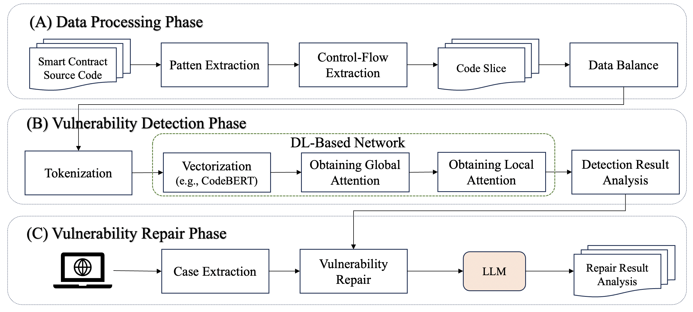

# HFM:
 
This repo include the code and datasets for paper: HMF-Enhancing Reentrancy Vulnerability Detection and Repair with a Hybrid Model Framework

# Introduction

Smart contracts have revolutionized the credit landscape. However, their security remains intensely scrutinized due to numerous hacking incidents and inherent logical challenges. 
One well-known issue is reentrancy vulnerability, exemplified by DAO attacks that lead to substantial economic losses. Previous approaches have employed rule-based and deep learning-based (DL) algorithms to detect and repair reentrancy vulnerability. Large language models (LLM) have been distinguished in recent years for their excellent understanding of text and code. However, less attention has been paid to LLM-based reentrancy vulnerability detection and repair, and direct prompt-based approaches often suffer from inefficiencies and high false positives. To overcome the above shortcomings, this paper proposes a hybrid model framework combining LLM with DL to enhance the detection and repair of reentrancy vulnerabilities. This unified framework comprises three crucial phases: the data processing phase, the vulnerability detection phase, and the vulnerability repair phase. Extensive experimental results validate the superiority of our approach over state-of-the-art baselines, and ablation studies demonstrate the effectiveness of each component. Our approach demonstrates significant improvements in vulnerability detection, with increases of 3.51% in accuracy, 2.31% in recall, 0.42% in precision, and 0.85% in F1-score. Furthermore, our approach can achieve a notable 9.62% enhancement in the repair rate. Finally, we also conducted a user study to emphasize its potential to fortify the security of smart contracts.

# Framework

## Workflow

## Illustrative Example

# Usage

You can start the model with the following command:

'''
python main.py --model transformer_cnn 
'''

# Details:

## main.py
This python file is entrance of overall framework. 

## extract_code_gadget.py
This python file can extract function-call-related code gadgets.

## get_balanced_dataset.py
This python file can balance the code agdgets.

## user_study_experiment.md
This markdown file shows the details of user study.
